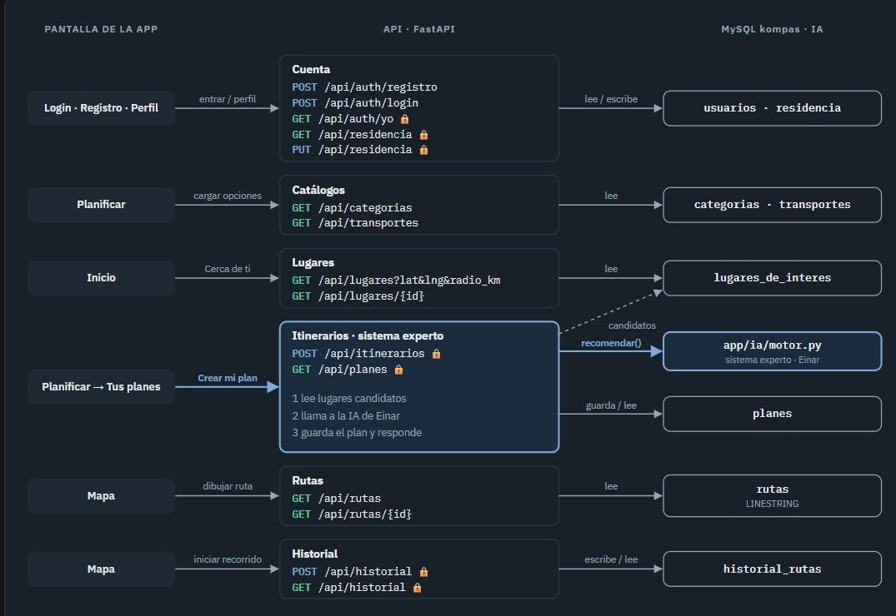

# Manual técnico: arquitectura, tecnologías, API e instalación

**Estado:** documentación del diseño recibido, para revisión de Jesús y backend. Ya se dispone del diagrama de pantallas, endpoints, MySQL e IA. La rama local contiene documentación y una demo; no un servidor, frontend o migraciones. La única instalación comprobada aquí es la demostración del sistema experto.

**Actualización documental 0.4.0:** se incorpora el [diagrama de endpoints](../referencias/diagrama-endpoints-2026-09-27.png), con 15 operaciones, FastAPI, MySQL y la llamada interna `recomendar()`. Complementa el [modelo provisional de datos](../referencias/diagrama-bd-provisional-2026-09-27.png) y la revisión de textos y estructura de seis marcos de [Figma](../diseno/mockups-y-flujo.md). La apariencia y las transiciones del prototipo siguen sin verificarse. El diagrama acredita el diseño comunicado, no la ejecución de sus endpoints.

## 1. Alcance de la primera versión

El usuario podrá plantear un destino o una salida con contexto, presupuesto y tiempo. La aplicación formará candidatos, obtendrá información de sus tramos y lugares, evaluará restricciones y explicará las opciones disponibles. La precisión estará limitada por la cobertura y actualidad de las fuentes integradas.

La comunidad queda fuera de este cuatrimestre salvo acuerdo posterior. Las tarifas reales de Uber/DiDi, la ocupación en vivo y la verificación automática de reportes no se incluyen como capacidades entregadas. Requieren fuentes e integraciones que todavía no existen en este repositorio.

## 2. Arquitectura documentada por el equipo

El diseño conecta pantallas de la aplicación con seis módulos de API FastAPI. Los módulos acceden a ocho entidades MySQL; el de itinerarios también llama al motor de IA. La captura original se conserva sin cambios:



La [decisión de SQL](../decisiones/almacenamiento-sql.md) se concreta ahora en MySQL según este diagrama. Se mantienen pendientes versión, controlador, migraciones y despliegue. La ruta `app/ia/motor.py` identifica el destino previsto del componente de Einar; el archivo todavía no existe en esta entrega.

Antes de implementar hay que definir qué guarda `planes`, cómo se selecciona una opción y cómo se asocian visitas y tramos; véase la [revisión del modelo](../modelo-datos/revision-modelo-provisional.md). El diagrama describe consultas al catálogo y geometrías almacenadas; no identifica proveedores externos ni asegura información actual de traslados.

La siguiente separación de responsabilidades complementa el dibujo para integrar las reglas. Planificador, adaptadores y normalizador son propuestas funcionales; su presencia en esta tabla no acredita código implementado.

| Módulo | Responsabilidad | Contrato principal |
| --- | --- | --- |
| Interfaz | Capturar solicitud y mostrar mapa, opciones y explicaciones. | Preferencias y restricciones explícitas. |
| API | Validar entradas, acceso, límites de consulta y errores. | Solicitud válida e identificador de consulta. |
| Planificador | Construir paradas y tramos, calcular el orden y evaluar cada candidato. | Candidatos completos y separados. |
| Adaptadores | Consultar proveedores y traducir respuestas a datos internos. | Valores, unidades, procedencia, vigencia y errores diferenciados. |
| Normalizador | Calcular costos, horarios y proposiciones. | Hechos conocidos o desconocidos. |
| Motor | Aplicar reglas y producir traza. | Estado, razones y preferencias. |
| Persistencia | Guardar datos propios o permitidos bajo el modelo aprobado. | Repositorios de acceso, sin acoplar reglas a consultas de base. |

## 3. Tecnologías: decisión y estado

| Elemento | Propuesta o acuerdo | Estado real |
| --- | --- | --- |
| Persistencia | Base relacional SQL; MySQL indicado en el nuevo diagrama. | Modelo provisional transcrito; sin conexión ni migraciones implementadas en esta rama. |
| Gestor y versión | MySQL como referencia de diseño. | Versión, controlador y configuración pendientes de backend. |
| Lenguaje de la demo | Python y biblioteca estándar. | Demostración ejecutada con Python 3.12.14. |
| Backend de aplicación | FastAPI, indicado en el diagrama del equipo. | Faltan versión, manifiestos, código y comandos de arranque. |
| Interfaz web | React + TypeScript + Vite como opción a discutir. | Estructura y textos de seis marcos revisados; apariencia y navegación pendientes. No hay aplicación ni dependencias fijadas. |
| Control de versiones | Git y GitHub, ramas y revisión mediante pull request. | Repositorio disponible. |
| Identidad | El dibujo protege siete operaciones mediante candados. | Sesión/token y propiedad de registros por definir. Google, Apple y recuperación de Figma no tienen operaciones explícitas en el catálogo recibido. |
| Mapas/lugares/rutas | Google Maps Platform como candidato. | No hay claves, facturación, cobertura ni integración comprobadas. |
| Perplexity / NotebookLM | Apoyos opcionales de investigación o documentación, según decisión del equipo. | No son dependencias del motor ni se presume una API de NotebookLM integrada. |

FastAPI permite publicar operaciones y esquemas mediante OpenAPI y documentación interactiva. Se utilizará ese contrato para contrastar este manual cuando exista la implementación. Referencia: [características oficiales de FastAPI](https://fastapi.tiangolo.com/features/). El dibujo no fija versiones de dependencias ni demuestra un servidor disponible.

## 4. APIs externas consideradas

Estos proveedores siguen siendo candidatos de la propuesta anterior; **no aparecen como integraciones confirmadas en el diagrama recibido**.

| Servicio candidato | Uso previsto | Límite relevante para el diseño |
| --- | --- | --- |
| Maps JavaScript API | Mapa en la interfaz. | Configurar atribución y una clave de navegador restringida cuando se implemente. |
| Places API (New) | Búsqueda y datos de lugares. | Campos y disponibilidad dependen de la respuesta; no asumir precio exacto, apertura o accesibilidad completa por una etiqueta. |
| Routes API | Tramos, duraciones e instrucciones de traslado. | Validar cobertura de camiones en la zona piloto antes de prometerla. |

Routes no admite paradas intermedias en una solicitud `TRANSIT`. Un itinerario de varias visitas requiere calcular tramos sucesivos con las horas correspondientes. Su tarifa de transporte solo se proporciona cuando el servicio puede determinarla para todos los tramos requeridos. La ausencia de tarifa se normaliza como desconocida. Referencia: [rutas en transporte público](https://developers.google.com/maps/documentation/routes/transit-route).

Places permite solicitar calificaciones y reseñas entre sus datos de detalles. Debe conservarse la atribución y respetarse su política de almacenamiento. Esto no demuestra disponibilidad de afluencia en vivo ni autoriza copiar toda la información a la base SQL. Referencias: [detalles de lugares](https://developers.google.com/maps/documentation/places/web-service/place-details) y [políticas de Places](https://developers.google.com/maps/documentation/places/web-service/policies).

Las estimaciones de una ruta vial no equivalen a una cotización de Uber o DiDi. Un enlace que abre otra aplicación no acredita un precio real; esa capacidad requiere su propia integración autorizada. No se implementa en esta entrega.

## 5. Flujo funcional y conexión con el diseño

1. La cuenta se registra o inicia sesión mediante las rutas de autenticación; el diseño exige identidad para crear itinerarios.
2. Inicio consulta lugares cercanos y Planificar obtiene los catálogos de categorías y transportes.
3. El usuario configura la salida. El contrato de IA necesita origen, fecha/hora, contexto, presupuesto, tiempo, regreso y preferencias; sus cuerpos HTTP siguen pendientes.
4. «Crear mi plan» llama a `POST /api/itinerarios`. Según el dibujo, el backend lee candidatos, invoca `recomendar()`, guarda el plan y responde.
5. La integración propuesta construye itinerarios completos, obtiene evidencias y normaliza hechos antes de aplicar las reglas. Esta ampliación es necesaria; no está implementada por la demo.
6. La interfaz compara opciones y explica motivos. El alcance del guardado anterior frente a la elección posterior se debe resolver con backend.
7. `GET /api/planes` consulta los planes y los GET de rutas aportan datos para el mapa.
8. Iniciar recorrido registra historial mediante `POST /api/historial`; ese evento no equivale a haber completado un viaje.

La propuesta anterior de creación de planes como invitado no forma parte del flujo protegido de este diagrama. Los endpoints sin candado visible tampoco se declaran públicos automáticamente: su política de acceso debe figurar en el contrato. Residencia, planes e historial necesitan comprobación de propiedad en servidor.

La [revisión funcional de mockups](../diseno/mockups-y-flujo.md) contrasta esta propuesta con los textos y estructura recuperados de Figma. Falta comprobar la navegación del prototipo. Entre los acuerdos pendientes están el presupuesto por persona o grupo, la duración total, el regreso y los estados sin opciones o con datos desconocidos. Si el plan de 4.5 horas pertenece a la búsqueda de 4 horas, no puede presentarse como «Mejor opción»: primero debe cumplir la restricción de tiempo.

## 6. Endpoints internos del diagrama

El [catálogo de 15 endpoints](../api/catalogo-endpoints.md) transcribe método, ruta y candados uno por uno. Sustituye los nombres tentativos anteriores; el prefijo observado es `/api`, sin `/v1`. No se han probado las operaciones contra un servidor.

| Módulo | Operaciones | Relación indicada |
| --- | --- | --- |
| Cuenta | POST registro/login; GET yo; GET/PUT residencia. | Usuarios y residencia. |
| Catálogos | GET categorías y transportes. | Opciones de planificación. |
| Lugares | GET listado cercano y detalle por ID. | Lugares candidatos. |
| Itinerarios / IA | POST `/api/itinerarios`; GET `/api/planes`. | Motor `recomendar()` y planes guardados. |
| Rutas | GET listado y detalle por ID. | Geometrías `LINESTRING` para el mapa. |
| Historial | POST y GET `/api/historial`. | Inicio de recorrido y consulta de historial. |

Para EP-10 se propone recibir preferencias y magnitudes; el servidor construye los hechos lógicos. No se expone la función de la demo como una API que confíe en booleanos proporcionados por el usuario. La [guía de integración de IA](../api/integracion-sistema-experto.md) distingue `evaluar(entrada, base)`, disponible en la demo, de `recomendar()`, previsto por el dibujo.

Propuesta de errores para acordar: validación de entrada con `422`; acceso sin identidad válida con `401`; acceso no autorizado con `403`; indisponibilidad total de dependencias con `503`. Una consulta válida sin opciones puede responder `200` con lista vacía y razones. Los códigos, formatos y política de reintentos deben fijarse en el contrato real.

Cada resultado debe identificar estimaciones, unidades, hora de evaluación, versión de reglas, inclusión de regreso y advertencias. El frontend no debe mostrar `pendiente_verificacion` como una ruta confirmada.

## 7. Instalación comprobada: demostración local

Requisitos: Python 3.12 para reproducir el entorno verificado; Git si se trabaja desde el repositorio. No requiere servidor de base de datos, `pip install`, claves de API ni servicios de pago.

Abrir una copia que contenga esta entrega: la carpeta incluida en el paquete descargable o la rama `docs/einar-sistema-experto-manual` cuando se publique en GitHub. Desde la carpeta del proyecto:

```bash
python3 herramientas/sistema_experto_demo.py
python3 herramientas/sistema_experto_demo.py --verificar
```

En Windows, usar `py -3` si esa es la forma de invocar Python en el equipo. Para revisar la traza estructurada:

```bash
python3 herramientas/sistema_experto_demo.py --json
```

Resultado esperado de la verificación de esta versión:

```text
OK: 36 comprobaciones; 20/20 reglas activadas al menos una vez.
```

Estos comandos ejecutan un ejemplo académico. No levantan un servidor web ni una aplicación de mapas.

## 8. Instalación de la aplicación: información pendiente

El diagrama ya identifica FastAPI y MySQL. Para una instalación de la aplicación todavía hacen falta versiones de runtime y dependencias, manifiestos y archivos de bloqueo, punto de entrada real del servidor, comandos de desarrollo/producción, variables de entorno de ejemplo, versión y preparación de MySQL, migraciones, puertos, autenticación y una consulta reproducible. No se inventa un comando de arranque para archivos que no existen en la entrega.

Los valores de configuración se documentarán mediante nombres y ejemplos sin secretos. Las credenciales de la base SQL y las claves privadas de servicios irán en el servidor; una clave de mapas para navegador debe tener restricciones apropiadas al dominio y API. La demo no necesita ninguna de ellas.

También se debe acordar qué devuelve cada adaptador ante timeout, cuota agotada y cobertura ausente. Estos casos se traducen a errores o hechos desconocidos según el contrato, nunca a costo cero ni ausencia de cierres.

## 9. Evidencia necesaria para aprobar esta sección

Ya se cuenta con modelo provisional, seis marcos revisados por contenido y el diagrama de arquitectura/endpoints con FastAPI y MySQL. La descripción de módulos y el catálogo quedan documentados. Faltan apariencia/navegación, versiones, contrato OpenAPI con esquemas, firma del motor, política de guardado de opciones, manifiestos, configuración de ejemplo, migraciones y ejecución comprobada de la instalación. La tarea queda lista para revisión documental, con integración e instalación de aplicación pendientes.
